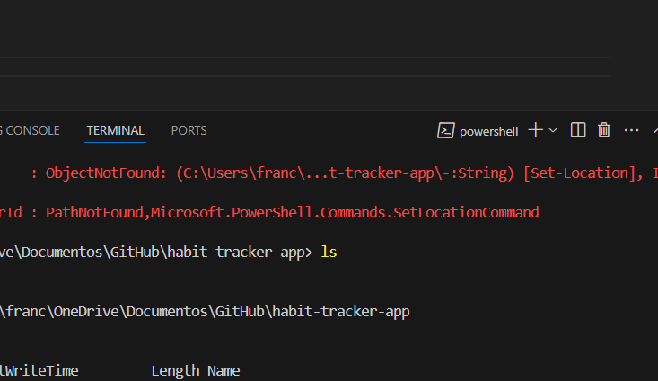

# 🌱 Habit Tracker Java App (Frontend with TailwindCSS)

A clean, modern Java application (React-based) for tracking personal habits. Users can define habits, mark them as completed, view progress in a calendar, and delete habits — all with undo support, confirmation messages, and persistent data via `localStorage`.

---

## 🚀 Features Overview

### ✅ Habit Management
- **Create Habits**:
  - Input form with validation for habit name and frequency.
  - Snackbar notification with 'Undo' (5s window).
  - Stored persistently in `localStorage`.

- **Delete Habits**:
  - Trash icon for each habit entry.
  - Confirmation modal before deletion.
  - Undo support with snackbar.
  - Data updates reflected in `localStorage`.

### 📅 Daily Habit Tracking
- Checkbox list of **today’s habits**.
- Toggle completion updates habit state.
- Confirmation toast and undo option.
- Stored by date in `localStorage`.

### 📊 Compliance Calendar
- `ComplianceCalendar` component with:
  - Color-coded days (green = all done, red = missed).
  - Habit streak visualization.
  - Hover tooltips for day-level habit breakdown.
- Calendar updates support undo via snackbar.
- All progress stored in `localStorage`.

---

## 💄 UI & UX Enhancements

### TailwindCSS Theming
- Calming primary color (e.g., teal/indigo).
- Soft gray backgrounds, sans-serif fonts.
- Styled with spacing, hover states, rounded corners.

### Interactive Design
- Action icons via `react-icons`: ➕ Add, ✅ Done, 🗑️ Delete.
- Fade/slide animations using **Framer Motion** or CSS transitions.
- Responsive layout via Tailwind grid/flex utilities.
- Light/dark mode toggle with theme saved in `localStorage`.

### Visual Feedback
- Toast/snackbar for all actions with undo.
- Emoji reactions: ✅ for done, 💪 for streak, 🗑️ for delete.
- Confetti on 100% daily completion using `react-confetti`.
- Flame badge for ongoing streaks (🔥 5-day streak) with count-up animation.
- Color-tag habits by category (e.g., health, work, study).

### Extras
- Circular progress ring component showing today’s completion %.
- Motivational quote banner at top with smooth entrance.
- Skeleton loaders for habit list/calendar while data loads.
- Frosted glass card UI with `backdrop-blur`.

---

## 🧠 Best Practices with Copilot & Firebase Studio

### 1. Be Specific
> Precise prompts yield better results.
- ❌ *"Make UI better"*  
- ✅ *"Arrange calendar left and habit list/form right in two-column layout on desktop, stacked on mobile."*

### 2. Iterate Frequently
Copilot works best in a feedback loop:  
**Prompt → Review → Refine → Repeat**

### 3. Understand Copilot
- **Strengths**: UI scaffolding, validation, boilerplate logic, debug assistance.
- **Limitations**: Needs guidance on architecture and complex logic.

### 4. Debug Smart
Provide the exact console/build error messages.  
Copilot can often resolve JSX errors, hydration issues, etc.

### 5. Review All Code
Never skip review. Copilot is a helper — not a substitute for good engineering practices.

### 6. Organize Your Code
Name files clearly (`.tsx` for JSX), keep modules clean, import/export properly. Copilot relies on this context.

### 7. Rapid Prototyping
Copilot is ideal for fast iteration: build, test, revise, discard.

---

## 🛠️ Tech Stack

- **Frontend Framework**: React + TypeScript
- **Styling**: TailwindCSS (with custom theme)
- **Animation**: Framer Motion
- **Icons**: react-icons
- **Confetti**: react-confetti
- **State Management**: useState + useEffect + localStorage
- **Data Persistence**: `localStorage` (or Firebase backend optionally)

---

## 📸 Screenshots

