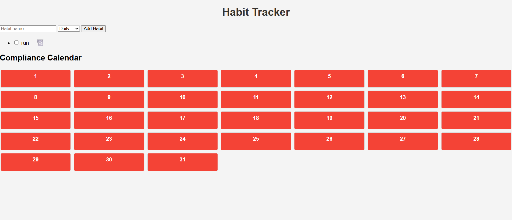
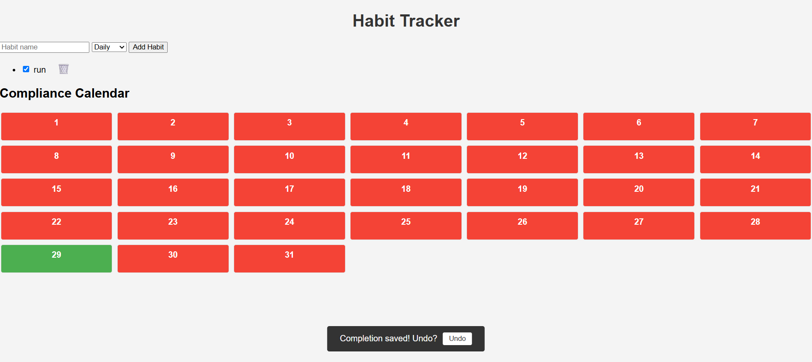
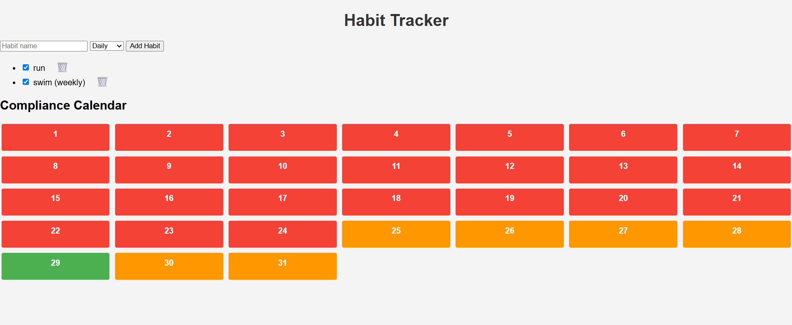
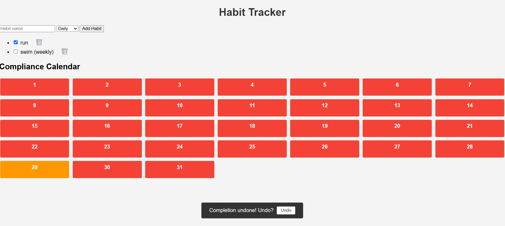
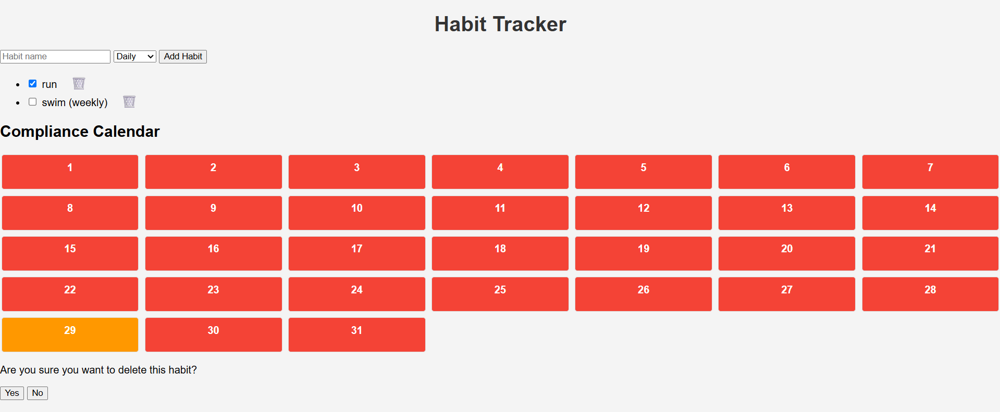

# Habit Tracker App

A modern and interactive Java-based habit tracker that allows users to define, manage, and visualize their personal habits. The app includes essential habit-tracking features like daily completion, a compliance calendar, undo actions, toast notifications, motivational messages, dark mode, and a polished UI using TailwindCSS.

---

## 🧠 Used Prompts

The development of this app was driven by detailed Copilot prompts:

- **Add habits**: Interface to create new habits with input validation, toast confirmations, and undo via snackbar.
- **Mark habits as completed**: Daily checklist with confirmation, undo support, and persistent status per day.
- **Compliance calendar**: Monthly progress view with color-coded days, streaks, tooltips, and undoable updates.
- **Delete habits**: Confirmation modal with toast, undo support, and persistent habit removal.
- **UI Enhancements**:
  - Use TailwindCSS for layout, typography, color palette, and responsive design.
  - Add icons (React Icons), skeleton loaders, smooth transitions (Framer Motion), and motivational banners.
  - Light/Dark mode toggle with persistence in `localStorage`.
  - SVG-based progress ring for today's completion.
  - Emoji-based user feedback (e.g., ✅, 💪, 🗑️).
  - Confetti celebration on full completion.
  - Tags and streak badges for each habit.

---

## 📸 Screenshots

## 📚 Lessons Learned Using Copilot

### 1. Specificity Drives Results
Copilot works best with **precise prompts**. Ambiguous inputs like “improve UI” often led to irrelevant suggestions. A structured prompt like “Place calendar on the left and habit list on the right using a responsive grid layout” produced excellent layouts.

### 2. Iterative Refinement is Crucial
Building this app was **not a one-shot task**. We continuously prompted Copilot, reviewed output, and refined our queries. Each feature (e.g., snackbar undo or calendar updates) evolved through 3–5 iterations.

### 3. Strengths and Weaknesses of Copilot

**✅ Strengths:**
- Great at generating boilerplate code, UI layouts, form handling, and Tailwind integration.
- Efficient with common state update patterns and undo flows using timeouts/snackbars.

**⚠️ Limitations:**
- Lacked broader architectural insight (e.g., optimal component splitting or complex data syncing).
- Needed help managing advanced state flows or edge case error handling.

### 4. Debugging with Copilot
Providing **full error logs** helped Copilot resolve hydration issues, JSX typos, and module import errors quickly. Context-aware fixes were suggested more effectively when file names or function names were included in the prompt.

### 5. Code Review Remains Key
Copilot-generated code was always **reviewed for optimization and reliability**. While helpful, its suggestions required human oversight to ensure maintainability.

### 6. Structured File Naming Helps
Naming files correctly (`.tsx` for JSX code), structuring folders clearly (`components/`, `hooks/`, `styles/`) improved Copilot's context awareness and imports.

### 7. Rapid UI Prototyping
Copilot significantly **accelerated prototyping**. We quickly scaffolded entire components like `ComplianceCalendar`, `NewHabitForm`, and the SVG-based `ProgressRing`.

---

## 🚀 Final Thoughts

This project proved how Copilot can be a powerful coding partner when used intentionally. From scaffolding the UI to refining state logic and animations, Copilot helped us iterate faster, explore more ideas, and focus on polishing user experience.

